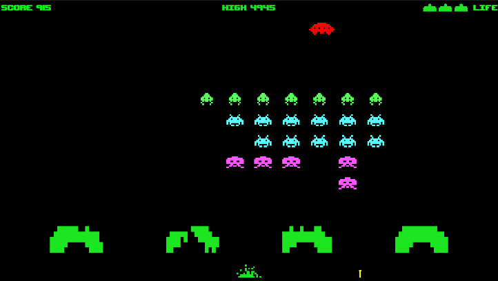

# Space Invader Clone V 1.27

I created a retro arcade game Space Invaders clone using Unity 6.0. My goal was to implement it using Scriptable Objects, Object Pools, and the Observer pattern.

- Recommended Unity version: Unity 6 (6000.0.32f1 and later)

[**[Play Game!!!]**](https://trymorez.github.io/unity-2d-platformer/Build/index.html)

## Screenshots

## Version History
**V 1.27 - (2025-01-18)**
- Fixed a bug where the player occasionally continued moving in the original direction after being destroyed

**V 1.26 - (2025-01-16)**
- Cleaned up the code and made it easier to read

**V 1.25 - (2025-01-15)**
- Fixed a bug where UFOs sometimes would not respawn

**V 1.2 - (2025-01-14)**
- UFO has been added to game
- All essential game logic have been implemented

**V 1.1 - (2025-01-14)**
- Level data has been implemented using Scriptable Objects

**V 1.0 - (2025-01-14)**
- Level progression has been implemented (not completed yet)
- Fixed several bugs related to resource pool management

**V 0.9 - (2025-01-13)**
- Now, invaders can attack the player with missiles.
- The player life routine has been implemented (default is 3 lives)

**V 0.8 - (2025-01-13)**
- The intro screen has been implemented.
- Fixed a bug where the player's laser sometimes disappears inappropriately.
- Changed the Rigidbody2D of the bunker to static and removed the bunker script (this will improve performance and reduce bugs).

**V 0.7 - (2025-01-12)**
- Score and high score implemented

**V 0.6 - (2025-01-12)**
- Sound effects have been added
- As the number of invaders decreases, the speed increases.
- Slightly reduced the size of the invader

**V 0.5 - (2025-01-11)**
- Animations have been added to invaders
- Invaders now move correctly at the edge of screen

**V 0.4 - (2025-01-11)**
- Colors have been applied to the invaders and bunkers
- Testing the basic movement of the invaders

**V 0.3 - (2025-01-10)**
- Invaders pool implemented (using dictionary and queue )
- Testing invaders spawning routine
- Testing shooting down invaders routine

**V 0.2 - (2025-01-10)**
- Now player ship can fire laser
- Laser object pool impremented
- Partially destructable bunker implemented

**V 0.1 - (2025-01-09)**
- First version
- Player ship movement test
- Asset test