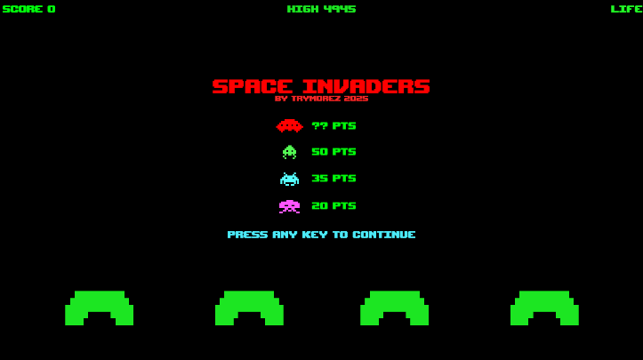

# Space Invader Clone (스페이스 인베이더 클론) V 0.3

I'm planning to create a retro arcade game, Space Invaders clone, using Unity 6.0. My goal is to implement it using Scriptable Objects, Object Pooling, and the Observer Pattern. Game is not currently not working.

레트로 아케이드 게임인 스페이스 인베이더를 유니티로 만들어보려고 합니다. 스크립터블 오브젝트, 오브젝트 풀, 옵서버 패턴을 사용해서 구현하는 것이 목표입니다. 아직 게임이 작동하는 상태는 아닙니다.

- Recommended Unity version: Unity 6 (6000.0.32f1 and later)

## Authors (제작자)

- [@trymorez](https://www.github.com/trymorez)

## Screenshots (스크린샷)

## Version History (버전 내역)
**V 0.3 - (2025-01-10)**
- Invaders pool implemented (using dictionary and queue )
- Testing invaders spawning routine
- Testing shooting down invaders routine

**V 0.2 - (2025-01-10)**
- Now player ship can fire laser
- Laser object pool impremented
- Partially destructable bunker implemented

**V 0.1 - (2025-01-09)**
- First version
- Player ship movement test
- Asset test